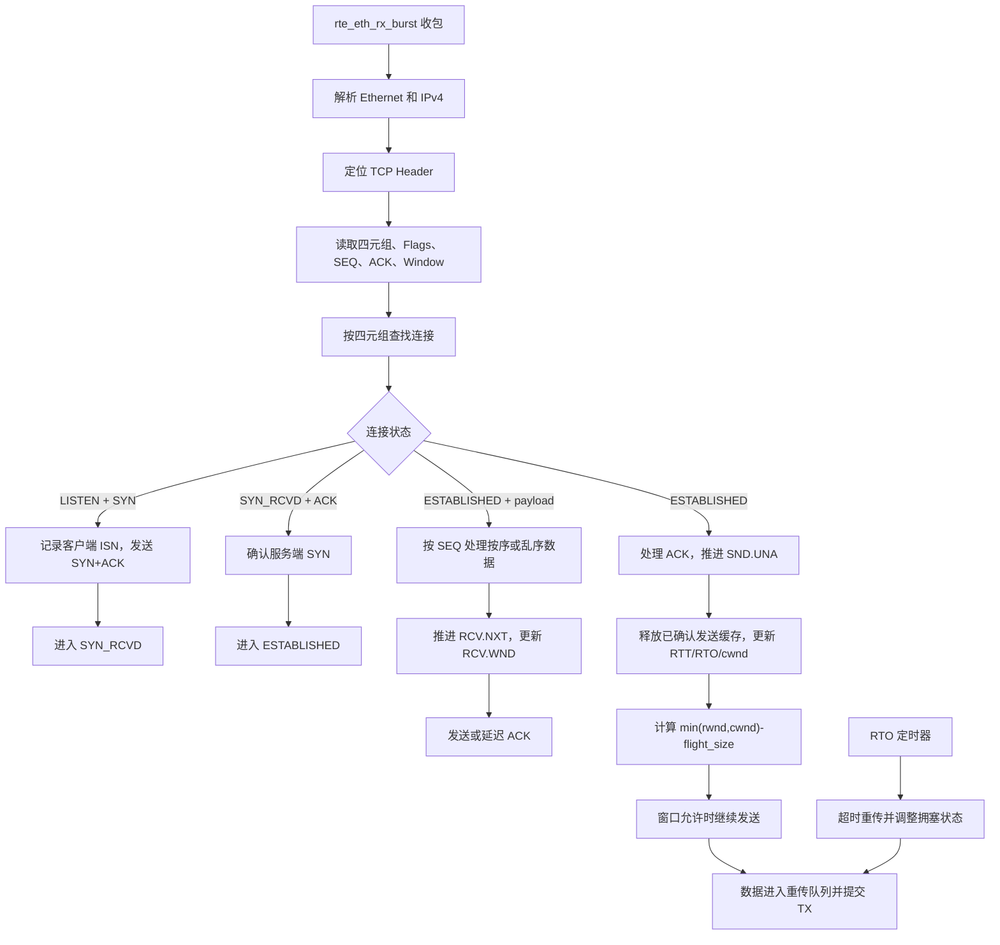

> 系列前文：
>
> - [DPDK 用户态协议栈设计与实现]()
> - [DPDK 用户态协议栈（二）：从收包到 UDP Echo 与 TCP 握手]()
>
> 前两篇已经讲过 DPDK 的收发路径、mbuf、Ethernet/IPv4/UDP/TCP Header、UDP Echo 和基础 TCP 握手。本篇直接沿着当前代码的执行顺序复习 TCP，并从代码中的 `flags、seq、ack、rx_win、tcp_status` 延伸到滑动窗口、延迟确认、重传、慢启动和拥塞控制。

---

## 一、先看当前代码的 TCP 主线

当前程序的 TCP 数据路径可以概括为：

```text
rte_eth_rx_burst() 从 RX Queue 取包
        ↓
解析 Ethernet Header
        ↓
解析 IPv4 Header
        ↓
next_proto_id == IPPROTO_TCP
        ↓
解析 TCP Header
        ↓
保存源/目的 MAC、IP、端口
        ↓
读取 flags、seq、ack
        ↓
根据 tcp_status 处理 SYN、ACK、PSH
        ↓
必要时构造 TCP 响应并通过 TX Queue 发出
```

代码中与 TCP 直接相关的全局信息是：

```c
uint8_t global_flags;
uint32_t global_seqnum;
uint32_t global_acknum;
```

它们分别保存当前收到的 TCP 报文中的：

```text
global_flags   ← TCP 控制位
global_seqnum  ← 对方本次发送的 SEQ
global_acknum  ← 对方本次携带的 ACK
```

状态机由下面的枚举描述：

```c
typedef enum __USTACK_TCP_STATUS {
    USTACK_TCP_STATUS_CLOSED = 0,
    USTACK_TCP_STATUS_LISTEN,
    USTACK_TCP_STATUS_SYN_RCVD,
    USTACK_TCP_STATUS_SYN_SENT,
    USTACK_TCP_STATUS_ESTABLISHED,
    USTACK_TCP_STATUS_FIN_WAIT_1,
    USTACK_TCP_STATUS_FIN_WAIT_2,
    USTACK_TCP_STATUS_CLOSING,
    USTACK_TCP_STATUS_TIMEWAIT,
    USTACK_TCP_STATUS_CLOSE_WAIT,
    USTACK_TCP_STATUS_LAST_ACK
} USTACK_TCP_STATUS;

uint8_t tcp_status = USTACK_TCP_STATUS_LISTEN;
```

当前代码主要走的是服务端路径：

```text
LISTEN
  ↓ 收到 SYN
SYN_RCVD
  ↓ 收到第三次握手 ACK
ESTABLISHED
  ↓
接收 TCP 数据
```

---

## 二、代码怎样识别并取得 TCP 报文

主循环先通过 DPDK 批量收包：

```c
struct rte_mbuf *mbufs[BURST_SIZE] = {0};

uint16_t num_recvd = rte_eth_rx_burst(
    global_portid,
    0,
    mbufs,
    BURST_SIZE
);
```

`num_recvd` 表示本次从 RX Queue 中取出的报文数量。程序随后遍历每一个 mbuf：

```c
for (i = 0; i < num_recvd; i++) {
    struct rte_ether_hdr *ethhdr =
        rte_pktmbuf_mtod(
            mbufs[i],
            struct rte_ether_hdr *
        );
```

先判断它是不是 IPv4：

```c
if (ethhdr->ether_type !=
    rte_cpu_to_be_16(RTE_ETHER_TYPE_IPV4)) {
    continue;
}
```

再取得 IPv4 Header：

```c
struct rte_ipv4_hdr *iphdr =
    rte_pktmbuf_mtod_offset(
        mbufs[i],
        struct rte_ipv4_hdr *,
        sizeof(struct rte_ether_hdr)
    );
```

最后根据 IPv4 Header 中的协议号进入 TCP 分支：

```c
if (iphdr->next_proto_id == IPPROTO_TCP) {
    struct rte_tcp_hdr *tcphdr =
        (struct rte_tcp_hdr *)(iphdr + 1);
}
```

在当前实验中，IPv4 Header 按基础 20 字节处理，所以使用 `(iphdr + 1)` 到达 TCP Header。进一步扩展时，可以根据 IHL 取得真实的 IPv4 Header 长度：

```c
uint16_t ip_hdr_len =
    (iphdr->version_ihl & 0x0f) * 4;

struct rte_tcp_hdr *tcphdr =
    (struct rte_tcp_hdr *)
    ((uint8_t *)iphdr + ip_hdr_len);
```

这里的层次关系是：

```text
Ethernet Header
IPv4 Header
TCP Header
TCP Payload
```

---

## 三、为什么代码要把地址和端口反过来保存

收到客户端发来的 TCP 包后，服务端回包的方向与收包方向正好相反。

### 1. MAC 地址交换

```c
rte_memcpy(
    global_smac,
    ethhdr->d_addr.addr_bytes,
    RTE_ETHER_ADDR_LEN
);

rte_memcpy(
    global_dmac,
    ethhdr->s_addr.addr_bytes,
    RTE_ETHER_ADDR_LEN
);
```

收到包时：

```text
源 MAC = 客户端 MAC
目的 MAC = 服务端 MAC
```

回包时：

```text
源 MAC = 服务端 MAC
目的 MAC = 客户端 MAC
```

所以把收到包的目的 MAC 保存为回包源 MAC，把收到包的源 MAC 保存为回包目的 MAC。

### 2. IP 地址交换

```c
rte_memcpy(&global_sip, &iphdr->dst_addr, sizeof(uint32_t));
rte_memcpy(&global_dip, &iphdr->src_addr, sizeof(uint32_t));
```

### 3. TCP 端口交换

```c
rte_memcpy(&global_sport, &tcphdr->dst_port, sizeof(uint16_t));
rte_memcpy(&global_dport, &tcphdr->src_port, sizeof(uint16_t));
```

最终得到一组回包方向的数据：

```text
global_smac   服务端 MAC
global_dmac   客户端 MAC
global_sip    服务端 IP
global_dip    客户端 IP
global_sport  服务端端口
global_dport  客户端端口
```

TCP 用下面的四元组区分连接：

```text
源 IP、源端口、目的 IP、目的端口
```

对于服务端而言，一般写成：

```text
local_ip、local_port、remote_ip、remote_port
```

---

## 四、代码怎样读取 Flags、SEQ 和 ACK

```c
global_flags = tcphdr->tcp_flags;
global_seqnum = ntohl(tcphdr->sent_seq);
global_acknum = ntohl(tcphdr->recv_ack);
```

### 1. Flags

`tcp_flags` 是一个字节，其中每一位代表一个控制标志：

```text
SYN  建立连接并同步初始序列号
ACK  ACK 字段有效
PSH  希望接收端尽快把数据交给应用
FIN  本方向没有更多数据需要发送
RST  复位连接
URG  Urgent Pointer 有效
```

一个报文可以同时带多个标志，例如：

```text
SYN | ACK
PSH | ACK
FIN | ACK
```

所以代码使用按位与判断某一位是否存在：

```c
if (global_flags & RTE_TCP_SYN_FLAG) {
    /* 包含 SYN */
}
```

### 2. SEQ 与 ACK 是 32 位字段

```c
global_seqnum = ntohl(tcphdr->sent_seq);
global_acknum = ntohl(tcphdr->recv_ack);
```

报文使用网络字节序，程序进行加减和比较时使用主机字节序，因此读取时调用 `ntohl()`。

回包时方向相反：

```c
tcp->sent_seq = htonl(seq);
tcp->recv_ack = htonl(ack);
```

可以记成：

```text
网络报文 → 主机整数：ntohs / ntohl
主机整数 → 网络报文：htons / htonl
```

其中：

```text
16 位：端口、Window、部分长度字段
32 位：IPv4 地址、SEQ、ACK
```

---

## 五、结合 `ustack_encode_tcp_pkt()` 看 SYN+ACK 的构造

当前编码函数依次组织 Ethernet、IPv4 和 TCP Header。

### 1. Ethernet Header

```c
struct rte_ether_hdr *eth =
    (struct rte_ether_hdr *)msg;

rte_memcpy(
    eth->d_addr.addr_bytes,
    global_dmac,
    RTE_ETHER_ADDR_LEN
);

rte_memcpy(
    eth->s_addr.addr_bytes,
    global_smac,
    RTE_ETHER_ADDR_LEN
);

eth->ether_type = htons(RTE_ETHER_TYPE_IPV4);
```

这一层说明后面的载荷是 IPv4。

### 2. IPv4 Header

```c
struct rte_ipv4_hdr *ip =
    (struct rte_ipv4_hdr *)(eth + 1);

ip->version_ihl = 0x45;
ip->type_of_service = 0;
ip->total_length = htons(
    total_len - sizeof(struct rte_ether_hdr)
);
ip->packet_id = 0;
ip->fragment_offset = 0;
ip->time_to_live = 64;
ip->next_proto_id = IPPROTO_TCP;
ip->src_addr = global_sip;
ip->dst_addr = global_dip;
ip->hdr_checksum = 0;
ip->hdr_checksum = rte_ipv4_cksum(ip);
```

`total_len` 是整个 Ethernet Frame 中由程序填写的长度。IPv4 的 `total_length` 不包括 Ethernet Header，所以要减去：

```c
sizeof(struct rte_ether_hdr)
```

### 3. TCP Header

```c
struct rte_tcp_hdr *tcp =
    (struct rte_tcp_hdr *)(ip + 1);

tcp->src_port = global_sport;
tcp->dst_port = global_dport;

tcp->sent_seq = htonl(12345);
tcp->recv_ack = htonl(global_seqnum + 1);

tcp->data_off = 0x50;

tcp->tcp_flags =
    RTE_TCP_SYN_FLAG |
    RTE_TCP_ACK_FLAG;

tcp->rx_win = htons(TCP_INIT_WINDOWS);

tcp->cksum = 0;
tcp->cksum = rte_ipv4_udptcp_cksum(ip, tcp);
```

这几行正好对应三次握手第二步：

```text
服务端自己的 SEQ = 12345
确认客户端 SYN 的 ACK = 客户端 SEQ + 1
Flags = SYN | ACK
```

`data_off = 0x50` 的高 4 位是 5，表示 TCP Header 长度为：

```text
5 × 4 字节 = 20 字节
```

本例没有 TCP Options，所以是最基础的 20 字节 TCP Header。

`rx_win` 是服务端通告给客户端的接收窗口。它是 16 位字段，写入报文时使用 `htons()`。

---

## 六、结合状态机完整理解三次握手

假设：

```text
客户端初始序列号 client_isn = 1234
服务端初始序列号 server_isn = 12345
```

### 第一次握手：客户端发送 SYN

```text
客户端 → 服务端

SYN=1
SEQ=1234
```

代码在 TCP 分支中读取到：

```c
global_flags  = RTE_TCP_SYN_FLAG;
global_seqnum = 1234;
```

随后进入：

```c
if (global_flags & RTE_TCP_SYN_FLAG) {
    if (tcp_status == USTACK_TCP_STATUS_LISTEN) {
        /* 构造 SYN+ACK */
    }
}
```

### 第二次握手：服务端回复 SYN+ACK

```text
服务端 → 客户端

SYN=1
ACK=1
SEQ=12345
ACK number=1235
```

代码中的对应关系：

```c
tcp->sent_seq = htonl(12345);
tcp->recv_ack = htonl(global_seqnum + 1);
tcp->tcp_flags = RTE_TCP_SYN_FLAG | RTE_TCP_ACK_FLAG;
```

发送后进入：

```c
tcp_status = USTACK_TCP_STATUS_SYN_RCVD;
```

表示服务端已经发送 SYN+ACK，正在等待客户端确认自己的 SYN。

### 第三次握手：客户端回复 ACK

```text
客户端 → 服务端

ACK=1
SEQ=1235
ACK number=12346
```

客户端的 SEQ 变成 1235，是因为它的 SYN 占用了一个序列号。

客户端的 ACK 是 12346，是因为服务端的 SYN 也占用了一个序列号。

代码收到 ACK 后：

```c
if (global_flags & RTE_TCP_ACK_FLAG) {
    if (tcp_status == USTACK_TCP_STATUS_SYN_RCVD) {
        printf("enter established\n");
        tcp_status = USTACK_TCP_STATUS_ESTABLISHED;
    }
}
```

于是状态变化为：

```text
LISTEN
  ↓ 收到 SYN
SYN_RCVD
  ↓ 收到确认服务端 SYN 的 ACK
ESTABLISHED
```

在连接数据结构中，可以保存：

```text
iss      = 12345       服务端初始发送序列号
irs      = 1234        客户端初始发送序列号
snd_una  = 12346       服务端最早未确认序号
snd_nxt  = 12346       服务端下一个发送序号
rcv_nxt  = 1235        服务端下一步期望收到的客户端序号
```

---

## 七、SEQ 的精髓：它是字节序号

TCP 提供的是字节流。SEQ 不是“第几个包”，而是当前 TCP 段中第一个数据字节的编号。

假设服务端当前发送：

```text
SEQ=12345
payload_len=100
```

那么该段中的 100 个数据字节对应：

```text
12345～12444
```

下一段新数据从：

```text
SEQ=12445
```

开始。

如果第二段有 500 字节：

```text
第二段：SEQ=12445，覆盖 12445～12944
第三段：SEQ=12945
```

所以发送新数据后：

```text
SND.NXT = SND.NXT + payload_len
```

如果报文还包含 SYN 或 FIN，则它们各自还要消耗一个序列号：

```text
sequence_space_len
  = payload_len
  + (SYN ? 1 : 0)
  + (FIN ? 1 : 0)
```

ACK 和 PSH 本身不占序列空间。

---

## 八、ACK 的精髓：确认连续收到的字节

假设服务端收到客户端的数据：

```text
SEQ=5000
payload_len=1000
```

数据覆盖：

```text
5000～5999
```

如果这些字节都按序收到，服务端返回：

```text
ACK=6000
```

`ACK=6000` 表示：

```text
6000 以前的连续序列字节已经收到，下一步期望 6000。
```

因此 ACK 是累计确认。假设发送方连续发送：

```text
[5000, 6000)
[6000, 7000)
[7000, 8000)
```

接收方可以直接回复：

```text
ACK=8000
```

一次确认前面三个连续区间。

在代码中，接收端用于生成 ACK 的核心状态可以写成：

```c
conn->rcv_nxt += payload_len;
tcp->recv_ack = htonl(conn->rcv_nxt);
```

---

## 九、一条 TCP 连接为什么有两套 SEQ/ACK

TCP 是全双工协议，两个方向可以同时传输数据：

```text
客户端 ─────客户端数据────→ 服务端
客户端 ←────服务端数据───── 服务端
```

两个方向分别有自己的序列空间：

```text
客户端发送方向：从 client_isn 开始编号
服务端发送方向：从 server_isn 开始编号
```

一个 TCP 报文中的两个字段分别表达：

```text
SEQ：我这次发送的数据从哪里开始
ACK：你发送的数据，我连续收到了哪里
```

使用“北京与广州互相运货”的类比：

```text
北京 → 广州：烤鸭编号是一套序列空间
广州 → 北京：白切鸡编号是另一套序列空间
```

每辆车都可以同时携带：

```text
SEQ：本车货物的起始编号
ACK：反方向货物已经连续收到的编号
Window：本地仓库还允许对方运来多少货物
```

所以双方都同时具有发送状态和接收状态。

---

## 十、代码怎样定位 TCP Payload

原代码在收到 PSH 后，通过 TCP Header 长度定位数据：

```c
uint8_t hdrlen =
    (tcphdr->data_off >> 4)
    * sizeof(uint32_t);

uint8_t *data =
    (uint8_t *)tcphdr + hdrlen;
```

`data_off` 的高 4 位以 4 字节为单位表示 TCP Header 长度：

```text
tcp_hdr_len = (data_off >> 4) × 4
```

若没有 TCP Options：

```text
data_off 高四位 = 5
TCP Header 长度 = 5 × 4 = 20 字节
```

TCP payload 长度可以通过 IPv4 总长度计算：

```c
uint16_t ip_total_len = ntohs(iphdr->total_length);
uint16_t ip_hdr_len = (iphdr->version_ihl & 0x0f) * 4;
uint16_t tcp_hdr_len = (tcphdr->data_off >> 4) * 4;

uint16_t payload_len =
    ip_total_len - ip_hdr_len - tcp_hdr_len;

uint8_t *payload =
    (uint8_t *)tcphdr + tcp_hdr_len;
```

这也解释了 TCP Header 为什么不需要像 UDP Header 那样再放一个长度字段：IPv4 总长度、IPv4 Header 长度和 TCP Header 长度已经能够计算出当前 TCP payload 长度。

PSH 可以理解为“希望接收端尽快把这部分数据交给应用”。处理代码时，是否存在 payload 仍以 `payload_len > 0` 为准。

---

## 十一、从 `rx_win` 理解 TCP 接收窗口

当前构造 TCP Header 时写入：

```c
#define TCP_INIT_WINDOWS 14600

tcp->rx_win = htons(TCP_INIT_WINDOWS);
```

这个字段是本端向对端通告：

```text
从 ACK 所表示的下一个期望字节开始，
我目前还愿意接收多少字节。
```

例如服务端回复：

```text
ACK=6000
Window=14600
```

可以理解为：

```text
6000 以前已经连续收到；
从 6000 开始，当前还能接收 14600 字节。
```

接收窗口通常与接收缓存关联：

```text
RCV.WND
  = 接收缓存总容量
  - 已收到但应用还没有读取的数据量
```

如果应用读取很慢，缓存逐渐占满：

```text
RCV.WND 逐渐减小
```

如果缓存完全占满：

```text
RCV.WND = 0
```

发送方看到零窗口后，暂停发送新的数据。接收端应用继续读取数据、释放缓存后，再通过 ACK 中的 Window 字段通告新的可用空间。

---

## 十二、发送窗口：`SND.UNA` 与 `SND.NXT`

发送端可以把序列空间分成四部分：

```text
已发送已确认      已发送未确认       窗口内尚未发送       当前不能发送
────────────┬────────────────┬──────────────────┬──────────→
          SND.UNA          SND.NXT       SND.UNA+SND.WND
```

### 1. `SND.UNA`

Send Unacknowledged，最早一个尚未被确认的序号。

### 2. `SND.NXT`

Send Next，下一个新数据应该使用的序号。

### 3. 在途数据量

```text
flight_size = SND.NXT - SND.UNA
```

表示已经发送、还没有累计确认的数据量。

### 4. 收到新 ACK 时窗口滑动

发送端原来是：

```text
SND.UNA=1000
SND.NXT=4000
```

说明 `[1000, 4000)` 已发送未确认。

收到：

```text
ACK=3000
```

之后：

```text
SND.UNA=3000
SND.NXT=4000
```

`[1000, 3000)` 已被确认，可以从重传队列和发送缓存中释放；窗口左边界向右移动，这就是“滑动窗口”。

---

## 十三、接收窗口与有序交付

接收端维护：

```text
RCV.NXT：下一步期望收到的序号
RCV.WND：从 RCV.NXT 开始还允许接收多少字节
```

序列空间可以表示为：

```text
已经连续收到          当前接收窗口               窗口之外
───────────────┬─────────────────────────┬────────────→
             RCV.NXT             RCV.NXT+RCV.WND
```

假设依次发送四段：

```text
A：[0, 400)
B：[400, 900)
C：[900, 1600)
D：[1600, 2000)
```

### 按序到达

收到 A：

```text
RCV.NXT 从 0 变成 400
```

收到 B：

```text
RCV.NXT 从 400 变成 900
```

### C 暂时没有到达，D 先到

接收端当前仍缺少从 900 开始的数据，因此：

```text
RCV.NXT 仍为 900
ACK 仍回复 900
D 可以暂存在乱序队列中
```

当 C 到达后：

```text
C 与已经缓存的 D 连续
RCV.NXT 可以从 900 一次推进到 2000
ACK 回复 2000
```

对应用程序而言，TCP 仍然按顺序交付：

```text
A → B → C → D
```

这就是 TCP 利用字节序号、累计 ACK 和乱序缓存实现有序字节流的过程。

---

## 十四、延迟确认怎样接入接收逻辑

收到数据后，接收端需要用 ACK 告诉发送端 `RCV.NXT`。ACK 可以有三种发送方式：

```text
立即发送纯 ACK
延迟一小段时间后发送 ACK
把 ACK 捎带在反方向数据中
```

延迟确认的主要目标是减少纯 ACK 数量，并等待是否有反方向数据可以一起发送。

可以先用下面的学习模型理解：

```text
收到第一个按序数据段
  → 更新 RCV.NXT
  → 设置 pending_ack
  → 启动 delayed ACK 定时器

定时器到期前又收到一个按序数据段
  → 再次更新 RCV.NXT
  → 立即发送累计 ACK

定时器到期
  → 发送 ACK=RCV.NXT

期间本端正好有数据要发
  → 把 ACK=RCV.NXT 填入数据段
  → 不再额外发送纯 ACK
```

遇到乱序段时，可以及时回复当前 `RCV.NXT`，让发送方看到重复 ACK 并发现连续数据中的缺口。

延迟确认属于接收端的 ACK 生成策略；超时重传和快速重传则是发送端恢复丢失数据的策略。

---

## 十五、为什么发送过的数据要暂时保存

调用：

```c
rte_eth_tx_burst(
    global_portid,
    0,
    &mbuf,
    1
);
```

表示把报文提交给 DPDK TX Queue。对于 TCP 来说，提交发送以后还要等待对方 ACK，才能确认该序列范围已经到达。

因此 TCP 需要发送缓存和重传队列：

```text
应用写入数据
  ↓
数据进入发送缓存
  ↓
按 MSS 和窗口切成 TCP 段
  ↓
记录每段的 seq_start、seq_end、发送时间
  ↓
构造 mbuf 并提交 TX
  ↓
等待 ACK
  ↓
收到累计 ACK 后释放已确认的数据
```

学习版重传项可以记录：

```c
struct tcp_tx_segment {
    uint32_t seq_start;
    uint32_t seq_end;
    uint16_t payload_len;
    uint8_t flags;
    uint64_t first_tx_us;
    uint64_t last_tx_us;
    uint32_t retransmit_count;
};
```

例如：

```text
重传队列：
[1000, 2000)
[2000, 3000)
[3000, 4000)
```

收到 `ACK=3000` 后：

```text
[1000, 2000) 已确认，移除
[2000, 3000) 已确认，移除
[3000, 4000) 继续等待
```

---

## 十六、超时重传：没有收到 ACK 时怎么办

发送一个 TCP 段时，发送端记录发送时间并启动重传定时器。如果在 RTO 到期前没有收到能够确认它的 ACK，就重新发送最早未确认的数据。

```text
发送数据段
  → 保存到重传队列
  → 启动 RTO 定时器
  → 收到新 ACK：推进 SND.UNA，重启或停止定时器
  → RTO 到期：重传最早未确认段
```

### 1. RTT

RTT 是数据发出到相应 ACK 返回所经历的往返时间：

```text
send_time ───────────────────── ack_time
              RTT
```

网络时延会变化，因此不能只用某一次 RTT 作为固定重传时间。

### 2. SRTT、RTTVAR 与 RTO

TCP 对 RTT 做平滑，并记录波动程度：

```text
SRTT    平滑 RTT
RTTVAR  RTT 波动估计
RTO     重传超时时间
```

核心关系是：

```text
RTO = SRTT + max(G, 4 × RTTVAR)
```

其中 `G` 是定时器时钟粒度。

第一次取得 RTT 样本 `R` 时：

```text
SRTT   = R
RTTVAR = R / 2
```

后续样本继续对两者进行平滑更新，使 RTO 能随网络情况变化。

### 3. RTO 指数退避

如果重传后仍然没有 ACK：

```text
RTO = RTO × 2
```

继续超时则继续退避：

```text
1RTO → 2RTO → 4RTO → 8RTO
```

这样可以避免网络已经拥塞时还以很高频率不断重传。

### 4. DPDK 主循环中的定时器

定时器处理不能阻塞轮询收包。主循环可以组织为：

```text
while (1) {
    处理 RX burst
    处理到期的 TCP timers
    发送 TX 待发送队列
}
```

需要处理的 TCP 定时器可以逐步包括：

```text
RTO timer
delayed ACK timer
zero-window persist timer
TIME_WAIT timer
```

---

## 十七、快速重传：通过重复 ACK 更早发现缺口

继续使用下面的序列：

```text
A：[0, 400)
B：[400, 900)
C：[900, 1600)   ← 丢失
D：[1600, 2000)
E：[2000, 2400)
F：[2400, 2800)
```

接收端收到 D、E、F 时，由于 C 仍未到达，连续前缀一直停在 900，于是多次回复：

```text
ACK=900
ACK=900
ACK=900
```

发送端看到多个重复 ACK，可以在 RTO 之前推断从 900 开始的数据可能丢失。

经典快速重传通常使用：

```text
3 个重复 ACK
  → 重传从 SND.UNA 开始的缺失段
```

如果握手时协商了 SACK，接收端还能在 TCP Options 中告诉发送端：

```text
[1600, 2800) 已经收到
```

发送端便能更准确地只补发缺失区间 `[900, 1600)`。

---

## 十八、接收窗口 rwnd 与拥塞窗口 cwnd

发送方决定本轮还能发送多少数据时，要同时考虑两种窗口。

### 1. rwnd：接收端通告窗口

来源：

```c
tcphdr->rx_win
```

含义：

```text
对方接收缓存还能容纳多少数据
```

它解决的是流量控制问题，避免发送速度超过对方应用和接收缓存的处理能力。

### 2. cwnd：拥塞窗口

`cwnd` 由发送端本地维护，不直接写在 TCP Header 中。

含义：

```text
根据当前网络状态，允许多少数据处于在途未确认状态
```

它解决的是拥塞控制问题，避免一次向网络注入过多数据。

### 3. 两个窗口共同限制发送

```text
send_limit = min(rwnd, cwnd)
flight_size = SND.NXT - SND.UNA
available = send_limit - flight_size
```

例一：

```text
rwnd = 64 KB
cwnd = 12 KB
flight_size = 8 KB

available = min(64, 12) - 8 = 4 KB
```

例二：

```text
rwnd = 4 KB
cwnd = 32 KB
flight_size = 3 KB

available = min(4, 32) - 3 = 1 KB
```

第一个例子受网络拥塞窗口限制，第二个例子受对端接收窗口限制。

---

## 十九、慢启动：逐步探测网络容量

连接刚建立时，发送端并不知道路径能容纳多少在途数据，所以用 `cwnd` 逐步试探。

为了理解增长过程，先假设：

```text
SMSS = 1000 字节
初始 cwnd = 1 × SMSS
```

### 第一个 RTT

```text
cwnd=1 MSS
发送 1 个 MSS
收到确认新数据的 ACK
cwnd 增长到约 2 MSS
```

### 第二个 RTT

```text
cwnd=2 MSS
发送 2 个 MSS
收到相应 ACK
cwnd 增长到约 4 MSS
```

### 第三个 RTT

```text
cwnd=4 MSS
发送 4 个 MSS
cwnd 增长到约 8 MSS
```

所以慢启动的教学曲线经常写作：

```text
1 → 2 → 4 → 8 → 16
```

它表示每经过一个 RTT，窗口大致成倍增长。具体实现中，初始窗口可以大于 1 MSS；理解重点是：

```text
慢启动阶段每收到确认新数据的 ACK，cwnd 增加；
一轮 RTT 中 ACK 数量随已发送数据增加，因此整体近似指数增长。
```

---

## 二十、拥塞避免：超过阈值后降低增长速度

TCP 连接还维护：

```text
ssthresh：慢启动阈值
```

两种阶段的关系是：

```text
cwnd < ssthresh  → 慢启动
cwnd > ssthresh  → 拥塞避免
```

慢启动阶段增长较快；进入拥塞避免后，经典算法让 `cwnd` 每个 RTT 大约增加一个 MSS。

```text
慢启动：近似指数增长
拥塞避免：近似线性增长
```

用窗口大小表示：

```text
慢启动：1、2、4、8、16
拥塞避免：16、17、18、19、20
```

实际数值由 ACK、MSS 和算法计算，不一定正好是整数段；这组数字主要用于观察增长形态。

### 发生 RTO 时

经典学习模型中：

```text
ssthresh = 当前在途数据量的一半，且至少为 2 MSS
cwnd = 1 MSS
重新进入慢启动
```

### 发生 3 个重复 ACK 时

说明后续数据仍在到达，发送端执行：

```text
快速重传
调整 ssthresh
进入快速恢复
```

这几个机制组合起来就是经典 TCP Reno 的核心：

```text
慢启动
拥塞避免
快速重传
快速恢复
```

---

## 二十一、把当前全局状态整理成一条连接的数据结构

目前的全局变量适合单连接实验。为了把已学习的概念放进代码，可以先整理成学习版连接控制块：

```c
struct tcp_connection {
    /* 四元组 */
    uint32_t local_ip;
    uint32_t remote_ip;
    uint16_t local_port;
    uint16_t remote_port;

    USTACK_TCP_STATUS state;

    /* 初始序列号 */
    uint32_t iss;
    uint32_t irs;

    /* 发送方向 */
    uint32_t snd_una;
    uint32_t snd_nxt;
    uint32_t snd_wnd;

    /* 接收方向 */
    uint32_t rcv_nxt;
    uint32_t rcv_wnd;

    /* 重传定时器 */
    uint64_t srtt_us;
    uint64_t rttvar_us;
    uint64_t rto_us;
    uint64_t rto_deadline_us;

    /* 拥塞控制 */
    uint32_t smss;
    uint32_t cwnd;
    uint32_t ssthresh;

    /* 发送缓存、重传队列、接收缓存、乱序队列 */
};
```

字段与知识点的对应关系：

| 代码字段 | TCP 含义 |
|---|---|
| `state` | 当前连接状态 |
| `iss` | 本端初始发送序列号 |
| `irs` | 对端初始发送序列号 |
| `snd_una` | 最早未确认的发送序号 |
| `snd_nxt` | 下一个新数据发送序号 |
| `snd_wnd` | 对端通告给本端的接收窗口 |
| `rcv_nxt` | 本端下一步期望收到的序号 |
| `rcv_wnd` | 本端当前可用接收窗口 |
| `srtt_us` | 平滑 RTT |
| `rttvar_us` | RTT 波动估计 |
| `rto_us` | 当前重传超时时间 |
| `cwnd` | 拥塞窗口 |
| `ssthresh` | 慢启动阈值 |

收到 TCP 报文后，通过四元组找到这条连接：

```text
(local_ip, local_port, remote_ip, remote_port)
        ↓
tcp_connection
```

每个客户端都有自己的状态、SEQ/ACK、窗口、缓存和定时器。

---

## 二十二、ESTABLISHED 状态收到数据时的完整思路

当前代码在看见 PSH 后取得并打印数据：

```c
if (global_flags & RTE_TCP_PSH_FLAG) {
    if (tcp_status == USTACK_TCP_STATUS_ESTABLISHED) {
        uint8_t hdrlen =
            (tcphdr->data_off >> 4)
            * sizeof(uint32_t);

        uint8_t *data =
            (uint8_t *)tcphdr + hdrlen;

        printf("tcp data: %s\n", data);
    }
}
```

把可靠传输补充进来以后，可以按下面的顺序理解：

```text
收到 ESTABLISHED 状态报文
        ↓
计算 ip_hdr_len、tcp_hdr_len、payload_len
        ↓
读取 SEG.SEQ、SEG.ACK、SEG.WND
        ↓
处理 ACK：推进 snd_una
        ↓
判断 SEG.SEQ 与 rcv_nxt 的关系
        ↓
按序数据写入接收缓存；乱序数据进入乱序队列
        ↓
推进 rcv_nxt
        ↓
根据缓存剩余量更新 rcv_wnd
        ↓
立即 ACK、延迟 ACK，或在反向数据中携带 ACK
        ↓
根据 min(snd_wnd, cwnd) 尝试继续发送
```

学习版伪代码：

```c
if (conn->state == USTACK_TCP_STATUS_ESTABLISHED) {
    tcp_process_ack(conn, seg_ack, seg_window);

    if (payload_len > 0) {
        if (seg_seq == conn->rcv_nxt) {
            recv_buffer_write(conn, payload, payload_len);
            conn->rcv_nxt += payload_len;

            consume_contiguous_out_of_order_data(conn);
            conn->rcv_wnd = recv_buffer_free_space(conn);

            schedule_or_send_ack(conn);
        } else if (seq_after(seg_seq, conn->rcv_nxt)) {
            queue_out_of_order_data(
                conn,
                seg_seq,
                payload,
                payload_len
            );

            send_ack(conn, conn->rcv_nxt);
        } else {
            send_ack(conn, conn->rcv_nxt);
        }
    }
}
```

这段伪代码把当前“读取 payload”的路径继续延伸为：

```text
有序接收 + 累计确认 + 乱序缓存 + 接收窗口
```

---

## 二十三、发送数据时的完整思路

当服务端应用有数据需要发送时：

```text
应用数据进入发送缓存
        ↓
读取 snd_wnd 和 cwnd
        ↓
计算当前还能发送多少
        ↓
按 SMSS 切分
        ↓
每段 SEQ = snd_nxt
ACK = rcv_nxt
Window = rcv_wnd
        ↓
保存到重传队列
        ↓
构造 Ethernet + IPv4 + TCP + payload
        ↓
rte_eth_tx_burst()
        ↓
snd_nxt 增加 payload_len
        ↓
启动或维护 RTO 定时器
```

核心计算：

```c
uint32_t flight_size = conn->snd_nxt - conn->snd_una;
uint32_t send_limit = RTE_MIN(conn->snd_wnd, conn->cwnd);

if (send_limit > flight_size) {
    uint32_t available = send_limit - flight_size;
    uint32_t send_len = RTE_MIN(available, conn->smss);
    /* 构造一个 send_len 字节的数据段 */
}
```

构造数据段时：

```c
tcp->sent_seq = htonl(conn->snd_nxt);
tcp->recv_ack = htonl(conn->rcv_nxt);
tcp->tcp_flags = RTE_TCP_ACK_FLAG | RTE_TCP_PSH_FLAG;
tcp->rx_win = htons(conn->rcv_wnd);
```

发送后：

```c
conn->snd_nxt += send_len;
```

收到累计 ACK 后：

```c
conn->snd_una = seg_ack;
```

于是发送窗口不断向右滑动。

---

## 二十四、用一次完整传输串起所有概念

假设握手结束后：

```text
服务端 snd_una = 12346
服务端 snd_nxt = 12346
服务端 rcv_nxt = 1235
对端通告 snd_wnd = 6000
服务端 cwnd = 3000
SMSS = 1000
```

### 1. 计算发送能力

```text
flight_size = 12346 - 12346 = 0
send_limit = min(6000, 3000) = 3000
available = 3000 - 0 = 3000
```

服务端可以先发送 3 个 1000 字节段：

```text
段 1：SEQ=12346，范围 [12346,13346)
段 2：SEQ=13346，范围 [13346,14346)
段 3：SEQ=14346，范围 [14346,15346)
```

发送后：

```text
snd_una = 12346
snd_nxt = 15346
flight_size = 3000
```

### 2. 对端累计确认

如果三个段都按序收到，对端回复：

```text
ACK=15346
```

服务端处理后：

```text
snd_una = 15346
snd_nxt = 15346
flight_size = 0
```

三个段都可以从重传队列中移除。

### 3. 慢启动增加 cwnd

ACK 确认了新数据，慢启动阶段继续增加 `cwnd`，下一轮允许更多在途数据，但仍受 `snd_wnd` 限制。

### 4. 中间一段丢失

如果第二段丢失，第三段到达，对端连续前缀只能到 13346，因此回复：

```text
ACK=13346
```

继续收到后续乱序段时仍回复相同 ACK。发送端可以通过重复 ACK 快速重传第二段；如果没有足够的后续 ACK，则由 RTO 定时器最终触发重传。

这一过程把以下概念连在了一起：

```text
SEQ
ACK
滑动窗口
接收窗口
拥塞窗口
慢启动
乱序队列
快速重传
超时重传
```

---

## 二十五、代码与 TCP 知识点对照表

| 当前代码 | 对应 TCP 含义 | 后续实现中保存的位置 |
|---|---|---|
| `tcphdr->sent_seq` | 当前段第一个序列号 | `SEG.SEQ` |
| `tcphdr->recv_ack` | 对端累计确认号 | `SEG.ACK` |
| `tcphdr->tcp_flags` | SYN/ACK/PSH/FIN/RST | 当前报文状态输入 |
| `tcphdr->rx_win` | 报文发送方通告的接收窗口 | 本端 `snd_wnd` |
| `tcp->rx_win` | 本端向对方通告的接收窗口 | 本端 `rcv_wnd` |
| `tcp_status` | 当前连接状态 | `conn->state` |
| `global_seqnum + 1` | 确认一个 SYN | `conn->rcv_nxt` |
| `12345` | 学习代码中的服务端 ISN | `conn->iss` |
| `data_off >> 4` | TCP Header 的 32 位字数量 | 计算 `tcp_hdr_len` |
| `rte_eth_tx_burst()` | 把报文交给 TX Queue | 发送路径 |
| `TCP_INIT_WINDOWS` | 初始接收窗口示例 | `conn->rcv_wnd` |
| 尚未加入 | 最早未确认序号 | `conn->snd_una` |
| 尚未加入 | 下一个新发送序号 | `conn->snd_nxt` |
| 尚未加入 | 下一个期望接收序号 | `conn->rcv_nxt` |
| 尚未加入 | 重传定时器 | `conn->rto_us` |
| 尚未加入 | 拥塞窗口 | `conn->cwnd` |
| 尚未加入 | 慢启动阈值 | `conn->ssthresh` |

---

## 二十六、整条 TCP 处理路径



---

## 二十七、复习时抓住的主线

### 第一条：连接状态

```text
LISTEN → SYN_RCVD → ESTABLISHED
```

状态决定当前收到的 Flags 应该怎样解释。

### 第二条：字节序列

```text
SEQ 标识本方向发送的数据
ACK 确认反方向连续收到的数据
```

### 第三条：发送可靠性

```text
数据发出后保留
ACK 到达后释放
重复 ACK 可触发快速重传
RTO 到期触发超时重传
```

### 第四条：有序接收

```text
RCV.NXT 之前已经连续收到
等于 RCV.NXT 的数据可以推进确认号
更大的 SEQ 暂存到乱序队列
缺口补齐后连续交付给应用
```

### 第五条：发送数量

```text
rwnd 保护接收端
cwnd 保护网络
实际发送上限取二者较小值
```

### 第六条：网络探测

```text
慢启动快速扩大 cwnd
到达 ssthresh 后进入拥塞避免
丢包或超时后降低发送强度
```

---

## 二十八、总结

当前代码用下面几行打开了理解 TCP 的入口：

```c
global_flags = tcphdr->tcp_flags;
global_seqnum = ntohl(tcphdr->sent_seq);
global_acknum = ntohl(tcphdr->recv_ack);
```

沿着它们继续向下，就是完整的 TCP 传输控制：

```text
Flags 驱动连接状态机
SEQ 给每个方向的数据字节编号
ACK 累计确认已经连续收到的字节
SND.UNA 与 SND.NXT 形成发送滑动窗口
RCV.NXT 与 RCV.WND 管理有序接收和接收缓存
发送缓存保留尚未确认的数据
重复 ACK 与 RTO 负责发现并恢复丢失
rwnd 控制接收端承受能力
cwnd、ssthresh、慢启动和拥塞避免控制网络中的在途数据
```

因此，从当前代码继续实现 TCP 的核心方向，就是把现在的全局 `flags、seq、ack、tcp_status` 扩展为每条连接独立的状态、序列空间、窗口、缓存和定时器。

---

## 参考规范

- [RFC 9293：Transmission Control Protocol](https://www.rfc-editor.org/rfc/rfc9293.html)
- [RFC 5681：TCP Congestion Control](https://www.rfc-editor.org/rfc/rfc5681.html)
- [RFC 6298：Computing TCP's Retransmission Timer](https://www.rfc-editor.org/rfc/rfc6298.html)
- [RFC 2018：TCP Selective Acknowledgment Options](https://www.rfc-editor.org/rfc/rfc2018.html)
